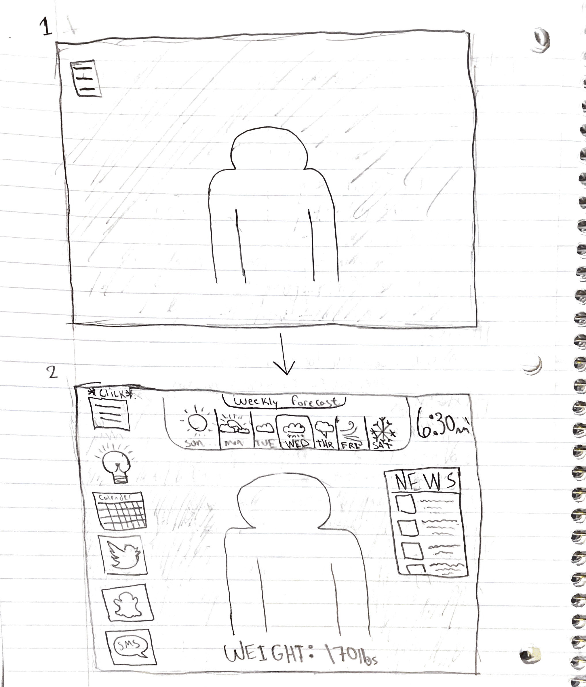

# p2.Karl.Devlin
Repo for project 2 of Human Comp. Interactions
# Report

## Part C
- **Sketch of Design**
* Provide the Sketch of your interface

* Include the general information in your sketch: personalized calendar, news feed, text messages, social feed items, clock, and weather. Include the health-related information in your sketch: sleep, weight, exercises, and mirror time.
  * Sketch contains:
    * Calendar, News, Social Feeds (Twitter, Snapchat, SMS Messenger), Clock, 7-day forecast, and weight
* About the Design:
  * I wanted my design to be discrete when not in use, while still functioning as a mirror while in use. To do this I implemented a hamburger menu icon that collapses and opens the mirrors applications when toggled. I took this idea a bit further and did the same thing with the calendar, snapchat, twitter, and messenger apps. This way the user can utilize the entire functionallity of the mirror while still being able to see their reflection.

## Part B
* Implement your Sketch in Processing or p5.js Implement the general information : personalized calendar (from a csv or json file), news feed (from a csv or json file), current clock, and local weather (from a file or api). Implement the health-related information in your sketch (select one of these): sleep, weight, exercises, and mirror time (from a csv or json file).
  * Used P5.js
  * Program contains:
    * Calendar
    * News feed
    * Current time and date
    * Local 7-day forecast
    * Scale that displays user's weight
*About the application:
  * The program application consists of three overlapping divs in the html-body; the weather widget (from weather-io), the news feed (from the new york times RSS key), and the p5sketch.js. Due to the way the draw() function works with processing I was unable to implement a calendar widget from google as the repetitive drawing triggered the CAPTCHA security system, disabling the widget. So, I opted for a simple .png file to show the calendar, twitter, snapchat, and messenger functionallity. The date and time is smple text that uses processing libray. Lastly, the weight is a simple text box and the background is an image file. The hardest part about this project was figuring out the css styling in order to display all of the content cohearently as well as getting the closing/opening of components due to on click events. 

## Part A
* Implement one of the advanced features. Provide your github report page and 2-minute presentation video. Please pay attention on the overal design and layout, and usability of your final interface.
  * Implemented the ability to act as a light source with different possible colors (red, orange, yellow, green, blue-green, blue, pink, and purple). Upon clicking the lightbulb button the color of the background cycles through the various colors.
  * Link to presentation video: https://youtu.be/2WjUkd1dxOY
* GIF of Final Interface

